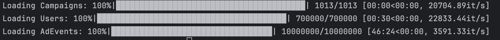

### How to run:

1. Copy CSV files to dataset folder: `hw1/dataset`
2. Open terminal and change your current directory to `hw1`
3. Create `.env` file from `.env.template` and specify all env variables 
4. Run bash script:
    ```commandline
    $ chmod +x run.sh && ./run.sh
    ```

### Results
#### 1. DDL scripts

Alembic is used to apply migrations on the database.
Offline migration is saved here: [migration.sql](./screenshots/migration.sql)

#### 2. Screenshots of data in DB

Screenshots can be found [here](./screenshots)

### Implementation Notes

The goal of this project is to upload data from CSV files to a normalised database.
Data in CSV files does not correspond to each table, so we fill multiple tables 
while processing one file.

Because the size of the data is huge and can be treated as streaming data, it would be
inefficient to read the file multiple times to fill in data for a single table.
Instead, we'll insert batches and insert corresponding values to each table
in order of relation, so that we have indexes for foreign keys.

The loading logic is implemented in [loaders](./src/loaders), one loader per CSV file.
[Alembic](http://alembic.sqlalchemy.org/en/latest/index.html) is used to create tables.

Depending on the hardware, the upload takes from 30 min to 1 hour:

